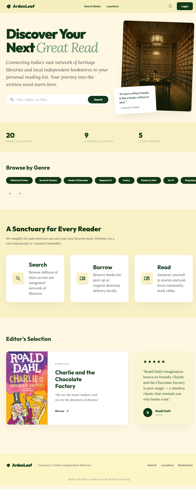
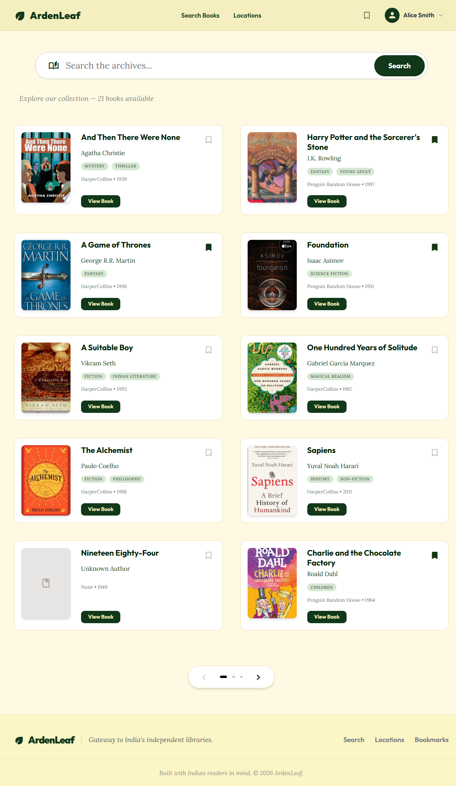
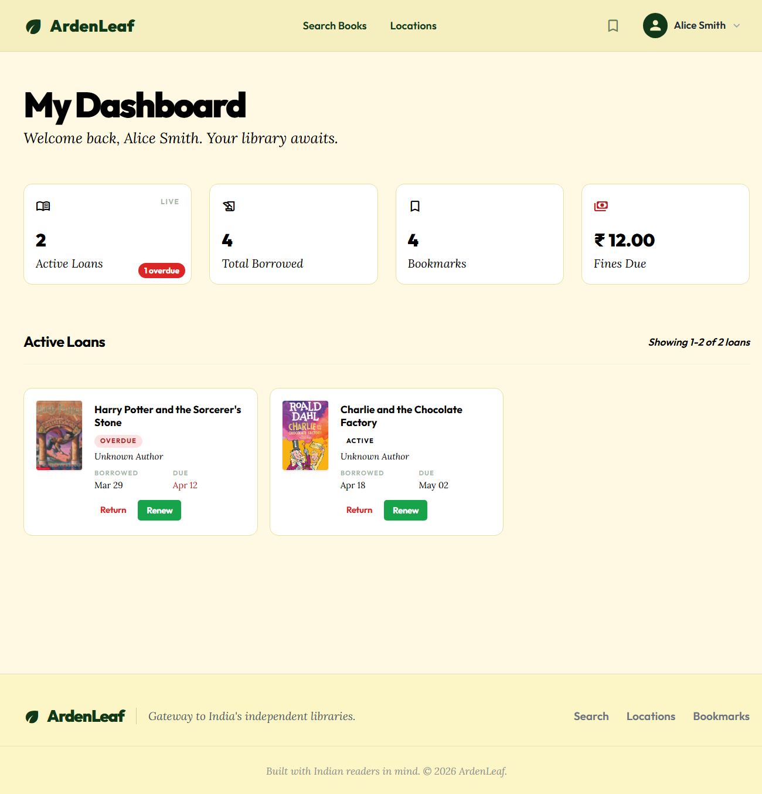
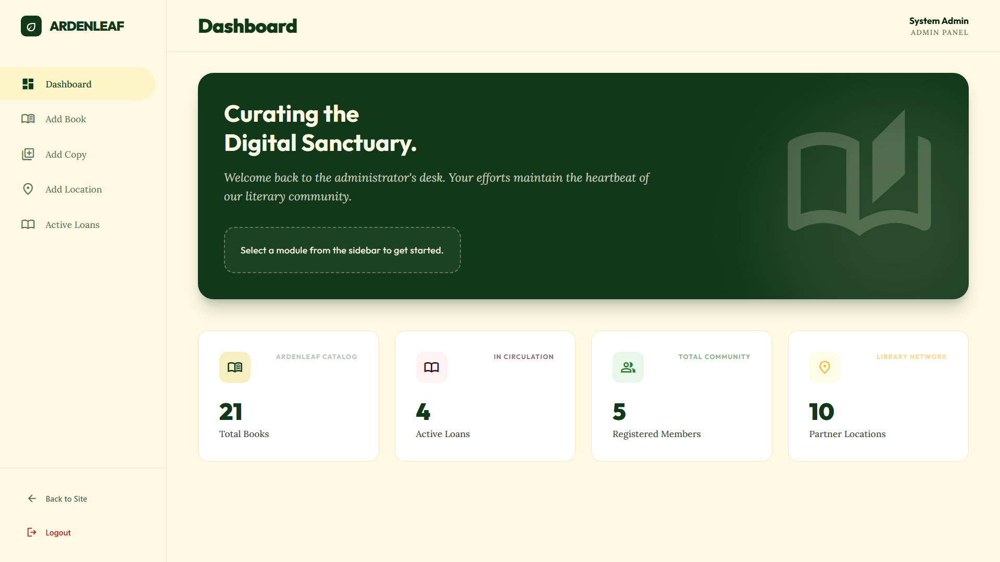
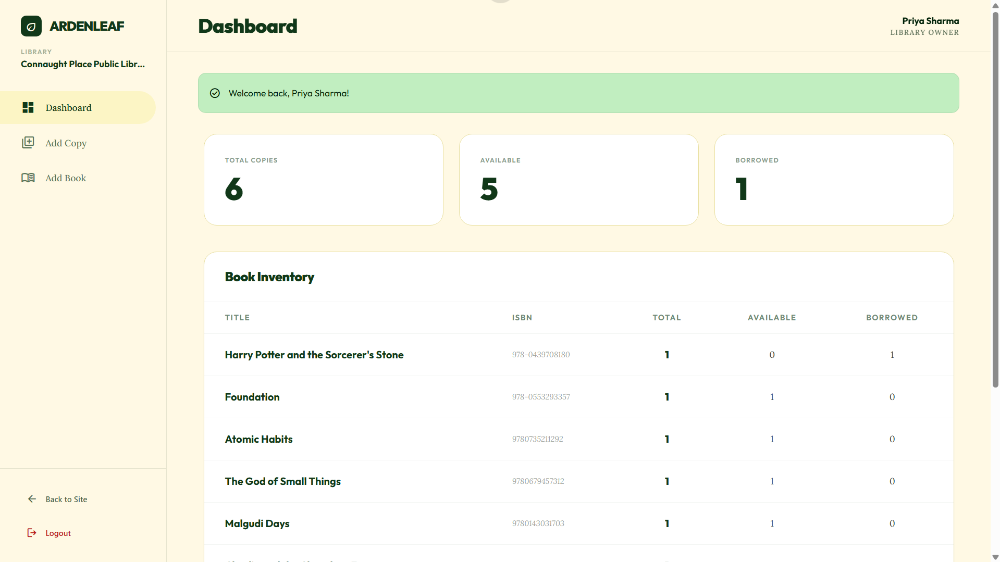

# ArdenLeaf

    

> A centralized book discovery and library management platform connecting independent libraries and bookstores across India.

**Live Demo:** [ardenleaf-production.up.railway.app](https://ardenleaf-production.up.railway.app)

---

## Highlights

*   **Production Deployed:** Fully functional full-stack application hosted on Railway.
*   **Multi-Role Auth:** Granular access control for Members, Library/Store Owners, and Super-Admins.
*   **Intuitive Dashboards:** Custom-tailored portals for different user types to manage loans, inventory, and stats.
*   **Relational Architecture:** Complex MySQL schema with foreign keys, views, and specialization patterns.
*   **Secure by Design:** Implements CSRF protection, password hashing, and secure session management.

---

## Overview

ArdenLeaf bridges the gap between India's heritage libraries and local bookstores. It provides a unified gateway for readers to discover titles, check real-time availability across physical locations, and manage library loans through a curated, modern interface.

---

## Screenshots

<p align="center">
  
  
</p>

<p align="center">
  
  
</p>

<p align="center">
  
</p>

---

## Technical Stack

| Layer | Technology |
|---|---|
| **Backend** | Python, Flask |
| **Database** | MySQL |
| **Frontend** | Jinja2, Tailwind CSS |
| **Integration** | Google Books API |
| **Infrastructure** | Railway |

---

## Try the Live Demo

Log in with one of these pre-seeded accounts to explore the platform:

| Role | Email | Password |
|---|---|---|
| **Admin** | admin@ardenleaf.com | admin123 |
| **Library Owner 1** | lib1@ardenleaf.com | libpass1 |
| **Library Owner 2** | lib2@ardenleaf.com | libpass2 |
| **Bookstore Owner 1** | store1@ardenleaf.com | storepass1 |
| **Bookstore Owner 2** | store2@ardenleaf.com | storepass2 |
| **Member** | *Register a new account* | — |

---

## Key Features

- ✅ **Smart Search:** Full-text search integrated with Google Books API, including cover art and metadata caching.
- ✅ **Availability Checking:** Real-time stock tracking across all partner locations (Available / Borrowed / Sold).
- ✅ **Loan Management:** Automated 14-day loan cycles with dynamic fine calculation (₹2/day).
- ✅ **Personalization:** Bookmarking system with genre-based filtering and live search.
- ✅ **Admin Controls:** Global catalog management and platform-wide loan monitoring.
- ✅ **Owner Portals:** Location-specific inventory management scoped by user session.

---

## Database Design

The system utilizes a 15-table relational schema optimized for multi-location inventory.

*   **Specialization Pattern:** Handles distinct user attributes for Members vs. Admins vs. Owners.
*   **Physical Tracking:** `BookCopy` decouples ISBN catalog data from local inventory, allowing one book to exist in multiple states and locations.
*   **Clean Data Model:** `LoanFines` is implemented as a MySQL VIEW to derive late fees in real-time without bloating tables.
*   **Security First:** All interactions use parameterized SQL to prevent injection attacks.

---

## Architecture

```
ArdenLeaf/
├── app.py               # App factory & blueprint registration
├── config.py            # Environment-based secure config
├── routes/              # Modular blueprints (auth, books, loans, admin, etc.)
├── models/              # Database access layer (DAO pattern)
├── utils/               # External clients (Google Books) & disk caching
├── templates/           # Jinja2 views (Admin, Owner, Member portals)
├── database/            # Schema definitions & seed scripts
└── static/              # Asset management
```

---

## Security Implementation

- **CSRF Protection:** Enforced across all forms and AJAX requests via Flask-WTF.
- **Credential Safety:** Passwords hashed using PBKDF2-SHA256 — never stored in plaintext.
- **Session Security:** Cookies configured with `HttpOnly`, `SameSite=Lax`, and `Secure` flags.
- **SQL Integrity:** Strict use of parameterized statements throughout the data layer.
- **Access Control:** Role-based logic enforced at the blueprint level via `before_request` guards.

---

## Ready for Local Launch?

1.  **Clone & Install:**
    ```bash
    git clone https://github.com/sanbidcantcode/ArdenLeaf.git
    cd ArdenLeaf
    pip install -r requirements.txt
    ```

2.  **Configure Environment:**
    Create a `.env` file with `MYSQL_HOST`, `MYSQL_USER`, `MYSQL_PASSWORD`, `MYSQL_DB`, `MYSQL_PORT`, and `SECRET_KEY`.

3.  **Boot Up:**
    Run the SQL scripts in `database/` against your MySQL instance, then:
    ```bash
    python app.py
    ```

---

## Roadmap & Potential Improvements

- [ ] Implementation of `Flask-Limiter` for auth endpoint rate limiting.
- [ ] Integration of a real payment gateway for bookstore sales.
- [ ] Addition of database indexes on high-frequency query columns for scaling.

---

Built by [Sanbid](https://github.com/sanbidcantcode) · [Live Demo](https://ardenleaf-production.up.railway.app) · [GitHub Repo](https://github.com/sanbidcantcode/ArdenLeaf)
